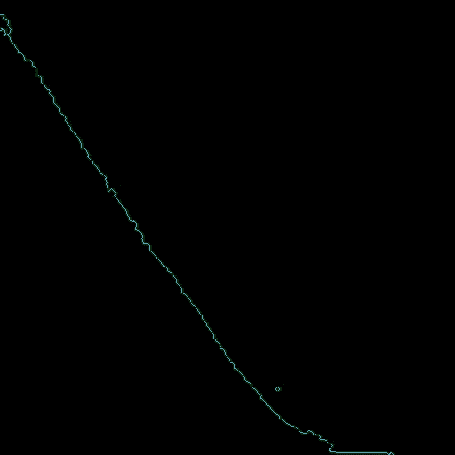

# Position Based Fluids



A relatively simple implementation of [Position Based Fluids](https://mmacklin.com/pbf_sig_preprint.pdf)
by Miles Macklin and Matthias Müller.
This is still very much a work in progress, as it doesn't fully implement the algorithm.

## Building

The code depends on [SDL2](https://www.libsdl.org/) and OpenGL. The Makefile
in this repo has only been tested on Linux.

Building with the Makefile should be pretty straightforward:
```bash
$ make
```

To build on Windows run `build.bat` from a terminal that can
run `cl.exe`. The required SDL2 files for building are included in
`third_party/SDL2`.

## User Interaction

Holding the left mouse button will add a force to all particles proprtional
to the distance between a particle and the mouse location, which can be used
to play around with the fluid.
